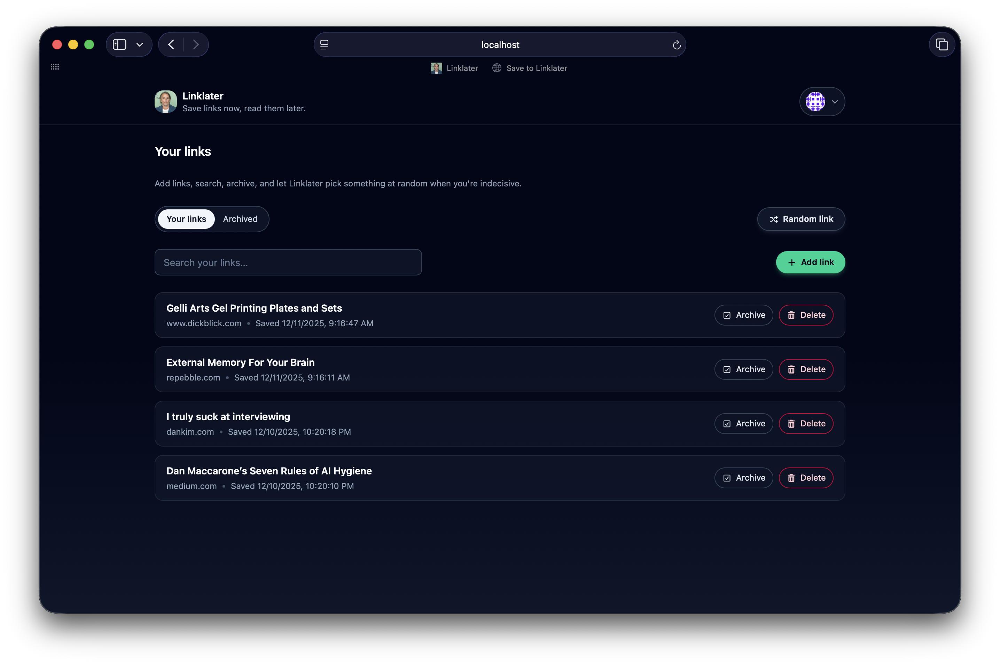
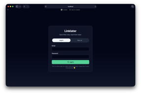
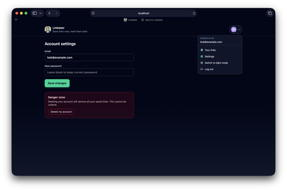
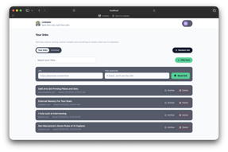

# Linklater

[](http://creativecommons.org/publicdomain/zero/1.0)

Linklater is an [Instapaper](https://www.instapaper.com)-inspired “read it later” app.

It’s both an homage to [Richard Linklater](https://en.wikipedia.org/wiki/Richard_Linklater) and a ridiculously apt portmanteau.



## Who Needs This?

Most curious adults come across dozens of interesting articles on any given day. Do they have time to read them all? Nope. Do they often forget about them? Totally.

**Linklater allows these articles to be saved quickly and easily for later reading.**

## Features

As a user, you can:

- Create an account
- Save links in-app or using the handy [bookmarklet](#bookmarklet)
- Search and [StumbleUpon](https://en.wikipedia.org/wiki/StumbleUpon)
- Toggle themes based on Richard Linklater's filmography
- Toggle between light and dark mode
- Delete your account and burn it to the ground

## Screenshots

Click on an image to open it full-size in a new browser tab:

<table>
  <tr>
    <td align="center">
      <a href="screenshots/account-settings.jpg">
        
      </a>
      <br><sub><em>Log In</em></sub>
    </td>
    <td align="center">
      <a href="screenshots/account-settings.jpg">
        
      </a>
      <br><sub><em>Account Settings</em></sub>
    </td>
    <td align="center">
      <a href="screenshots/light-mode.jpg">
        
      </a>
      <br><sub><em>Themes</em></sub>
    </td>
  </tr>
</table>

## Tech Stack

- **Front-end**: React + [Vite](https://vite.dev) + [Tailwind](https://tailwindcss.com) + [Font Awesome](https://fontawesome.com)
- **Back-end**: [NestJS](https://nestjs.com)
- **Database**: Prisma + PostgreSQL
- **Authentication**: [Passport](https://www.passportjs.org)
- **Jobs:** [pg-boss](https://timgit.github.io/pg-boss/#/)
- **Linting**: ESLint + Prettier
- **Testing**: Vitest (front-end) + Jest (back-end)

## Monorepo Structure

It’s a majestic modular monorepo!

```txt
apps
├─ api/          # NestJS back-end
├─ web/          # React + Vite front-end
├─ package.json  # root workspace + scripts
└─ README.md
```

## Bookmarklet

Linklater includes a one-click bookmarklet that saves the current page directly to your collection — no new tab, no form to fill out.

To install it, go to **Settings → Bookmarklet** and drag the _Save to Linklater_ button to your bookmarks bar. Your auth token is pre-embedded so clicking it on any page immediately calls the API and shows a confirmation toast.

The token embedded in the bookmarklet expires after 90 days. If saving stops working, revisit Settings and reinstall it.

## Local Development

### Prerequisites

- Node 25
- PostgreSQL 18

### Install Dependencies

```bash
# cd /path/to/your/repo
npm install
```

### Set Environment Variables

You'll need to set the database url and JWT secret on the back-end, and the API's base url on the front-end for Vite to access.

```bash
# cd /path/to/your/repo

cp apps/api/.env.example apps/api/.env  # set DATABASE_URL, JWT_SECRET
cp apps/web/.env.example apps/web/.env  # set VITE_API_BASE_URL
```

### Run Database Migrations

```bash
# cd /path/to/your/repo/apps/api
npx prisma migrate dev --name init
npx prisma generate
```

> **Note:** Run `npx prisma generate` after any migration. The custom client output path in this project prevents `migrate dev` from triggering it automatically.

### Start Development Server

```bash
# cd /path/to/your/repo
npm run dev
```

This uses `concurrently` to run NestJS on [localhost:3000](http://localhost:3000) and Vite on [localhost:5173](http://localhost:5173).

**Open [localhost:5173](http://localhost:5173) in your web browser and you're good to go!**

### Linting, Tests, and CI

Both the front and back-end use ESLint and Prettier. Vitest is used to test the front-end and Jest is used to test the back-end. GitHub Actions lint and test on pushes and PRs to `main`.

```bash
# cd /path/to/your/repo

# lint + test everything
npm run lint
npm run test

# lint + test front-end only
npm run lint --workspace @linklater/web
npm run test --workspace @linklater/web

# lint + test back-end only
npm run lint --workspace @linklater/api
npm run test --workspace @linklater/api
```
