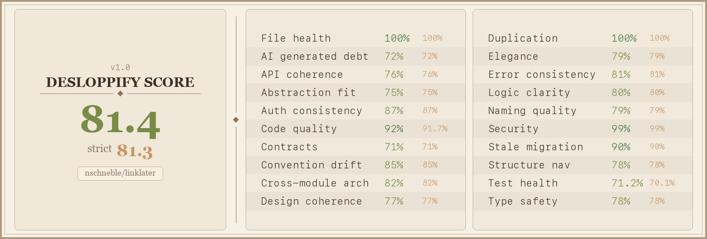
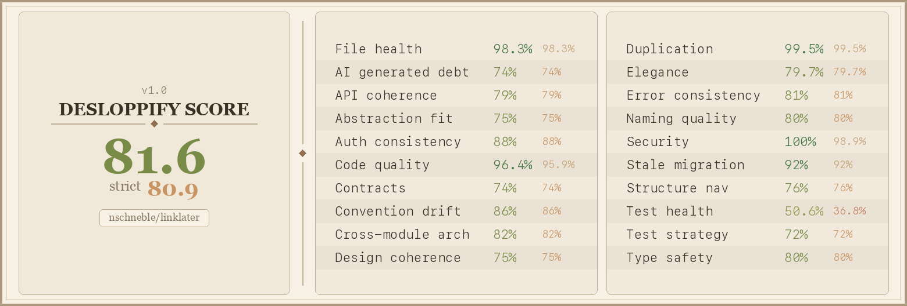

# Linklater

[](http://creativecommons.org/publicdomain/zero/1.0)

Linklater is an [Instapaper](https://www.instapaper.com)-inspired “read it later” app.

It’s both an homage to [Richard Linklater](https://en.wikipedia.org/wiki/Richard_Linklater) and a ridiculously apt portmanteau.


## Who needs this?

Most curious adults come across dozens of interesting articles on any given day. Do they have time to read them all? Nope. Do they often forget about them? Totally.

**Linklater allows these articles to be saved quickly and easily for later reading.**

## Features

As a user, you can:

- Create an account with passwords, magic links, and/or Google SSO
- Save links in-app or using the handy [bookmarklet](#bookmarklet)
- Search and [stumble!](https://en.wikipedia.org/wiki/StumbleUpon)
- Preview themes based on Richard Linklater's filmography
- Toggle between light and dark mode
- Generate API tokens for third-party integrations
- Delete your account and burn it to the ground

## Screenshots

Click on an image to open it full-size in a new browser tab:

<table>
  <tr>
    <td align="center">
      <a href="screenshots/log-in.jpg">
        
      </a>
      <br><sub><em>Log In</em></sub>
    </td>
    <td align="center">
      <a href="screenshots/account-settings.jpg">
        
      </a>
      <br><sub><em>Account Settings</em></sub>
    </td>
    <td align="center">
      <a href="screenshots/light-mode.jpg">
        
      </a>
      <br><sub><em>Themes</em></sub>
    </td>
  </tr>
</table>

## Tech stack

- **Front-end**: React + [Vite](https://vite.dev) + [Tailwind](https://tailwindcss.com) + [Font Awesome](https://fontawesome.com)
- **Back-end**: [NestJS](https://nestjs.com)
- **Database**: Prisma + PostgreSQL
- **Authentication**: [Passport](https://www.passportjs.org)
- **Jobs:** [pg-boss](https://timgit.github.io/pg-boss/#/)
- **Linting**: ESLint + Prettier
- **Testing**: Vitest (front-end) + Jest (back-end)

## Monorepo structure

It’s a majestic modular monorepo!

```txt
apps
├─ api/          # NestJS back-end
│  └─ README.md  # .env, modules, auth, jobs
│
├─ web/          # React + Vite front-end
│  └─ README.md  # .env, components, state, API, routes
│
├─ package.json  # root workspace + scripts
└─ README.md
```

## Code health

Linklater's code quality is tracked with [Desloppify](https://github.com/peteromallet/desloppify), which scores each app independently across file health, code quality, duplication, security, and test health.

<table>
  <tr>
    <td align="center" width="50%">
      <a href="apps/api/scorecard.png">
        
      </a>
      <br><sub><em>api</em></sub>
    </td>
    <td align="center" width="50%">
      <a href="apps/web/scorecard.png">
        
      </a>
      <br><sub><em>web</em></sub>
    </td>
  </tr>
</table>

## Bookmarklet

Linklater includes a one-click bookmarklet that saves the current page directly to your account.

To install, go to **Settings → Bookmarklet** and drag the _Save to Linklater_ button to your bookmarks bar. Your auth token is embedded, so you can immediately click it on any page to save the link.

## Local development

### Prerequisites

- Node 22.x
- PostgreSQL 18
- [Mailpit](https://mailpit.axllent.org/)

### Install dependencies

```bash
# cd /path/to/your/repo
npm install
```

### Set environment variables

You'll need to set the database url, JWT secret, app url, and SMTP values on the back-end, and the API's base url on the front-end for Vite to access.

```bash
# cd /path/to/your/repo

# set DATABASE_URL, JWT_SECRET, APP_URL, SMTP_*
cp apps/api/.env.example apps/api/.env

# set VITE_API_BASE_URL
cp apps/web/.env.example apps/web/.env
```

### Run database migrations

```bash
# cd /path/to/your/repo
bin/migrate
bin/migrate --help
bin/migrate --reset
```

> **Note:** Use `bin/migrate` or `npm run migrate` instead of calling `npx prisma migrate dev` directly. Prisma 7's `prisma-client` generator requires a custom output path, so `migrate dev` does not automatically regenerate the client.

### Start development server

```bash
# cd /path/to/your/repo
npm run dev

# -OR-

# start the development server TUI
bin/dev
bin/dev --help
```

Linklater uses `concurrently` to run NestJS on port 3000 and Vite on port 5173. **Open [https://localhost:5173](https://localhost:5173) in your web browser and you're good to go!**


### Linting, tests, and CI

Both the front and back-end use ESLint and Prettier. Vitest is used to test the front-end and Jest is used to test the back-end. GitHub Actions lint and test on pushes and PRs to `main`.

```bash
# cd /path/to/your/repo

npm run format
npm run lint
npm run test

# -OR-

# install, format, lint, test, and build in one TUI
bin/flintest
bin/flintest --help
bin/flintest --update
```

### Versioning

Create a new version in four easy steps!

1. Run the `version:bump` script
2. Update the new CHANGELOG section
3. Create a version tag
4. [Create a new release](https://github.com/nschneble/linklater/releases/new) and paste in the new CHANGELOG section

```bash
# cd /path/to/your/repo
npm run version:bump -- 0.3.0

# create a version tag
git commit -m "Bump version to 0.3.0"
git tag -a v0.3.0 -m "v0.3.0"
git push origin main
git push origin v0.3.0
```
