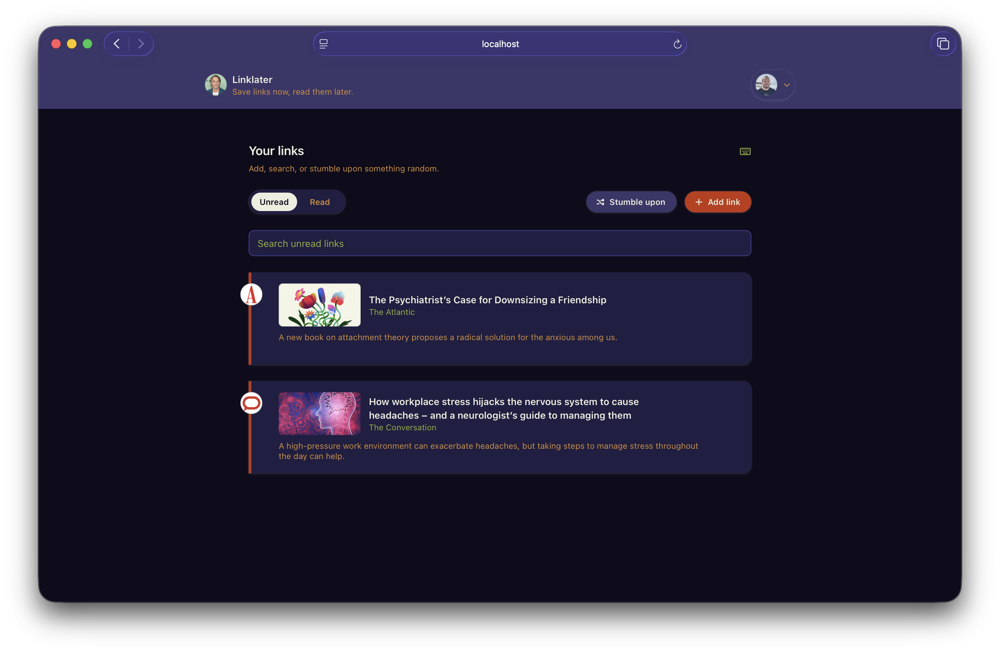
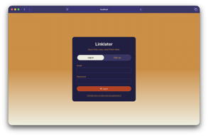
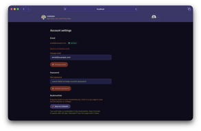
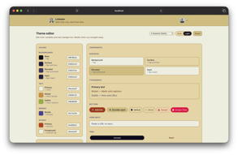
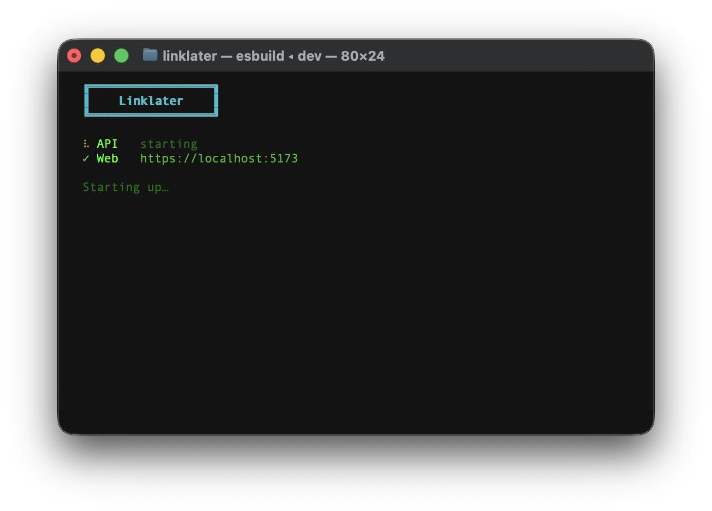

# Linklater

[](http://creativecommons.org/publicdomain/zero/1.0)

Linklater is an [Instapaper](https://www.instapaper.com)-inspired “read it later” app.

It’s both an homage to [Richard Linklater](https://en.wikipedia.org/wiki/Richard_Linklater) and a ridiculously apt portmanteau.



## Who needs this?

Most curious adults come across dozens of interesting articles on any given day. Do they have time to read them all? Nope. Do they often forget about them? Totally.

**Linklater allows these articles to be saved quickly and easily for later reading.**

## Features

As a user, you can:

- Create an account with passwords, magic links, and/or Google SSO
- Save links in-app or using the handy [bookmarklet](#bookmarklet)
- Search and [stumble!](https://en.wikipedia.org/wiki/StumbleUpon)
- Preview themes based on Richard Linklater's filmography
- Toggle between light and dark mode
- Generate API tokens for third-party integrations
- Delete your account and burn it to the ground

## Screenshots

Click on an image to open it full-size in a new browser tab:

<table>
  <tr>
    <td align="center">
      <a href="screenshots/log-in.jpg">
        
      </a>
      <br><sub><em>Log In</em></sub>
    </td>
    <td align="center">
      <a href="screenshots/account-settings.jpg">
        
      </a>
      <br><sub><em>Account Settings</em></sub>
    </td>
    <td align="center">
      <a href="screenshots/light-mode.jpg">
        
      </a>
      <br><sub><em>Themes</em></sub>
    </td>
  </tr>
</table>

## Tech stack

- **Front-end**: React + [Vite](https://vite.dev) + [Tailwind](https://tailwindcss.com) + [Font Awesome](https://fontawesome.com)
- **Back-end**: [NestJS](https://nestjs.com)
- **Database**: Prisma + PostgreSQL
- **Authentication**: [Passport](https://www.passportjs.org)
- **Jobs:** [pg-boss](https://timgit.github.io/pg-boss/#/)
- **Linting**: ESLint + Prettier
- **Testing**: Vitest (front-end) + Jest (back-end)

## Monorepo structure

It’s a majestic modular monorepo!

```txt
linklater/
├─ apps/
│  ├─ api/          # NestJS back-end
│  │  └─ README.md  # .env, modules, auth, jobs
│  │
│  └─ web/          # React + Vite front-end
│     └─ README.md  # .env, components, state, API, routes
│
├─ package.json     # root workspace + scripts
└─ README.md
```

## Deployment

Hosting choices and the production deploy flow are documented in [the deployment decision record](docs/DEPLOYMENT.md). In short: pushing a version tag (`vX.Y.Z`) builds the container images, publishes them, and rolls them onto the VPS over SSH.

## Bookmarklet

Linklater includes a one-click bookmarklet that saves the current page directly to your account.

To install, go to **Settings → Bookmarklet** and drag the _Save to Linklater_ button to your bookmarks bar. Your auth token is embedded, so you can immediately click it on any page to save the link.

## Local development

### Prerequisites

- Node 22.x
- PostgreSQL 18
- [Mailpit](https://mailpit.axllent.org/)

### Install dependencies

```bash
# cd /path/to/your/repo
npm install
```

### Set environment variables

You'll need to set the database url, JWT secret, app url, and SMTP values on the back-end, and the API's base url on the front-end for Vite to access.

```bash
# cd /path/to/your/repo

# set DATABASE_URL, JWT_SECRET, APP_URL, SMTP_*
cp apps/api/.env.example apps/api/.env

# set VITE_API_BASE_URL
cp apps/web/.env.example apps/web/.env
```

### Run database migrations

```bash
# cd /path/to/your/repo
bin/migrate
bin/migrate --help
bin/migrate --reset
```

> **Note:** Use `bin/migrate` or `npm run migrate` instead of calling `npx prisma migrate dev` directly. Prisma 7's `prisma-client` generator requires a custom output path, so `migrate dev` does not automatically regenerate the client.

### Start development server

```bash
# cd /path/to/your/repo
npm run dev

# -OR-

# start the development server TUI
bin/dev
bin/dev --help
```

Linklater uses `concurrently` to run NestJS on port 3000 and Vite on port 5173. **Open [https://localhost:5173](https://localhost:5173) in your web browser and you're good to go!**



### Linting, tests, and CI

Both the front and back-end use ESLint and Prettier. Vitest is used to test the front-end and Jest is used to test the back-end. GitHub Actions lint and test on pushes and PRs to `main`.

```bash
# cd /path/to/your/repo

npm run format
npm run lint
npm run test

# -OR-

# install, format, lint, test, and build in one TUI
bin/flintest
bin/flintest --help
bin/flintest --update
```

#### Visual regression tests

Visual + accessibility regression coverage is provided by [Tuffgal](https://www.npmjs.com/package/tuffgal):

- Stories live in `tuffgal/stories/`
- Committed baselines live in `tuffgal/baselines/`, but are written only by CI
- Local `tuffgal/.cache/` holds advisory self-diffs for use during development

```bash
# cd /path/to/your/repo

# one-time setup to create the test database + seed the test user
npm run tuffgal:setup

# run the dev server in test mode + self-diffs current renders against local cache
npm run dev:test
npm run tuffgal

# refresh local cache to accept current renders (does not touch committed baselines)
npm run tuffgal:approve

# forward Tuffgal flags after `--`
npm run tuffgal:approve -- --desktop --new-only  # only new renders + for one breakpoint
npm run tuffgal:approve -- user-logs-in          # single story
```

> **Note:** The `--` is required. Without it `npm` keeps the flags for
> itself instead of forwarding them to `tuffgal approve`.

Updating committed baselines is a PR review step. On a PR, CI captures
Linux renders and reports new, changed, and deleted stories via a sticky
comment plus a candidates artifact. A maintainer with write access comments
`@tuffgal approve` on the PR, and a bot commits the canonical Linux
baselines + `manifest.json` to the branch. No local command writes
committed baselines.

##### Authoring stories

Stories live in `tuffgal/stories/` as JSON files. Each step uses one of
the built-in primitives: `navigate`, `click`, `input`, `scroll`,
`intercept`, `waitFor`, `read`, `type`, `wait`. The `read` step supports
CSS escape hatches (`:focus`, `:has-text()`) for behavioral assertions.

Reference: [npmjs.com/package/tuffgal](https://www.npmjs.com/package/tuffgal)
· [github.com/nschneble/tuffgal](https://github.com/nschneble/tuffgal)

### Font Awesome

Font Awesome Free is self-hosted under `public/assets/fontawesome/`. The
shipped `.woff2` files are a subset of what's actually used in the app. The
full webfonts live alongside the build script at
`scripts/font-awesome-source/`.

To add a new icon, add its name (without the `fa-` prefix) to the `solid`
or `brands` array in `scripts/font-awesome-manifest.json`, then run
`npm run subset-fa` and commit the regenerated `.woff2` files.

A vitest in `scripts/font-awesome-manifest.test.ts` enforces the sync
between the manifest and icons referenced in `src/` and `index.html`.

### Versioning

Create a new version in four easy steps!

1. Run the `version:bump` script
2. Update the new CHANGELOG section
3. Create a version tag
4. [Create a new release](https://github.com/nschneble/linklater/releases/new) and paste in the new CHANGELOG section

```bash
# cd /path/to/your/repo
npm run version:bump -- 0.3.0

# create a version tag
git commit -m "Bump version to 0.3.0"
git tag -a v0.3.0 -m "v0.3.0"
git push origin main
git push origin v0.3.0
```

### Advanced

#### Remote access (LAN)

The development server TUI has a `--remote` option which allows Linklater to be discoverable by other devices on the same Wi-Fi network.

```bash
# cd /path/to/your/repo
bin/dev --remote

# Linklater is now available on https://linklater.local:5173
```

##### One-time setup for mobile devices

The tech stack uses [mkcert](https://github.com/FiloSottile/mkcert) for HTTPS. Mobile devices need to trust the mkcert root certificate authority, or the connection will be refused.

1. Find the root CA on the computer where Linklater is running:

```bash
mkcert -CAROOT
# ~/Library/Application Support/mkcert
```

2. AirDrop (iOS) or transfer (Android) `rootCA.pem` to your mobile device

3. Install the certificate
   1. **On iOS:** Settings → General → VPN & Device Management. Then enable trust under Settings → General → About → Certificate Trust Settings.
   2. **On Android:** Settings → Security → Install from storage → CA certificate.

##### Set a friendly hostname (optional)

By default the LAN url uses your Mac's Bonjour hostname.

To get `linklater.local` instead:

```bash
sudo scutil --set LocalHostName linklater
```

This is a one-time system-level change and persists across reboots.

#### Remote access (public)

The development server TUI has a `--public` option which allows Linklater to be discoverable publicly using a [Cloudflare TryCloudflare tunnel](https://github.com/cloudflare/cloudflared).

```bash
# cd /path/to/your/repo
bin/dev --public

# Linklater is now available on https://wildly-foxy-rice-pilaf.trycloudflare.com
```

#### Known limitations

- Google SSO won't work; OAuth callback URLs are pinned to localhost
- The bookmarklet generated on the Settings page won't work
