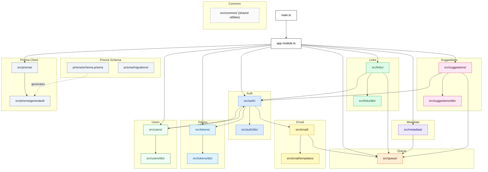

# NestJS back-end

The Linklater REST API handles auth, link storage, background jobs,
and personal access tokens.

## File hierarchy

## Where the wild components are

| I want to…                            | I should open…                               |
| ------------------------------------- | -------------------------------------------- |
| Add a background job                  | `src/queue/`                                 |
| Add a transactional email             | `src/email/templates/`                       |
| Add or change an auth flow            | `src/auth/`                                  |
| Adjust user profile                   | `src/users/`                                 |
| Change link CRUD or search            | `src/links/`                                 |
| Edit PAT lifecycle                    | `src/tokens/`                                |
| Edit shared utils                     | `src/common/`                                |
| Edit suggested links (RSS feeds)      | `src/suggestions/`                           |
| Touch the Prisma schema or migrations | `prisma/schema.prisma`, `prisma/migrations/` |
| Tweak Open Graph metadata fetching    | `src/metadata/`                              |
| Wire up a new OAuth provider          | `src/auth/*.strategy.ts`                     |

## A few explanations

All environment variables, defaults, and local development notes are in `.env.example`

The OpenAPI spec is served at `/openapi.json`

An unauthenticated `/health` endpoint returns `200` when the database answers a `SELECT 1` and `503` when it does not, so orchestrators and deploy checks can gate on it. The response body also reports the background-job queue state (`queue: 'up' | 'down'`) from an in-memory read of pg-boss — informational only, it does not change the status code

Coding patterns, NestJS rules, and migration requirements are documented in `.claude/CLAUDE.md` at the repo root
