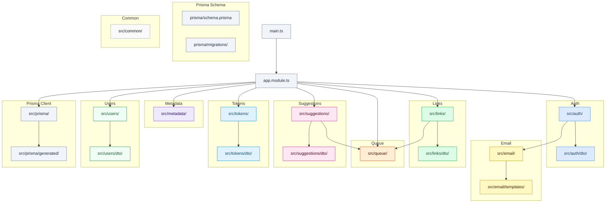

# NestJS Back-End

REST API for Linklater — handles auth, link storage, background jobs,
and personal access tokens.

## File Hierarchy

## Where Things Live

| I want to...                              | Open                                          |
| ----------------------------------------- | --------------------------------------------- |
| Add or change an auth flow                | `src/auth/`                                   |
| Wire a new OAuth provider                 | `src/auth/*.strategy.ts`                      |
| Add a transactional email                 | `src/email/templates/`                        |
| Change link CRUD or search                | `src/links/`                                  |
| Tweak Open Graph metadata fetching        | `src/metadata/`                               |
| Add a background job                      | `src/queue/`                                  |
| Edit suggested links (RSS / Wikipedia)    | `src/suggestions/`                            |
| Edit PAT lifecycle (create / revoke)      | `src/tokens/`                                 |
| Touch the Prisma schema or migrations     | `prisma/schema.prisma`, `prisma/migrations/`  |
| Adjust user profile / deletion            | `src/users/`                                  |
| Edit shared crypto, date, or logger utils | `src/common/`                                 |

## Pointers

- **Environment variables** — all vars, defaults, and local dev notes are in
  [`.env.example`](./.env.example).
- **Endpoint contracts** — the machine-readable OpenAPI spec is served at
  `/openapi.json` and rendered in the app at `/settings/api`.
- **Conventions** — coding patterns, NestJS rules, and migration requirements
  are documented in [`.claude/CLAUDE.md`](../../.claude/CLAUDE.md) at the
  repo root.
- **Monorepo setup** — local dev commands and workspace structure are in the
  [root README](../../README.md).
