# React + Vite front-end

The Linklater web app is a React + Vite SPA that lets authenticated users save, browse, and stumble through links.

## File hierarchy

```mermaid
graph TD
    subgraph Root["src/"]
        App["App.tsx"]
        AppShell["AppShell.tsx"]
        main["main.tsx"]
        css["index.css"]
    end

    subgraph Auth["auth/"]
        AuthContext["AuthContext/"]
    end

    subgraph Theme["theme/"]
        ThemeContext["ThemeContext/"]
        styles["styles/"]
    end

    subgraph Lib["lib/"]
        api["api/"]
        hooks["hooks/"]
        openapi["openapi/"]
        apiDocs["apiDocs/"]
        utils["navigation.ts · dates.ts · strings.ts · …"]
    end

    subgraph Routes["routes/"]
        routeConfig["route config"]
    end

    subgraph Components["components/"]
        Header["Header.tsx"]
        subgraph CompAuth["auth/"]
            authComps["AuthCard · AuthForm · LoginRegisterView · OAuthCallbackPage · MfaView · …"]
        end
        subgraph CompLinks["links/"]
            LinkCard["LinkCard/"]
            linksComps["LinksView · LinksList · LinksControls · …"]
        end
        subgraph CompSettings["settings/"]
            ThemeEditor["ThemeEditor/"]
            ApiTokensList["ApiTokensList/"]
            settingsComps["SettingsLayout · TotpSetupView · IdPsSection · PasswordSettingsForm · …"]
        end
        subgraph CompStumble["stumble/"]
            stumbleComps["StumblePage · StumbleSection · StumbleEmptyView · …"]
        end
        subgraph CompLanding["LandingPage/"]
            landingComps["HeroSection · FeaturesSection"]
        end
        subgraph CompUserMenu["UserMenu/"]
            userMenuComps["MenuSection · MobileBottomSheet · …"]
        end
        subgraph CompApiDocs["api-docs/"]
            apiDocsComps["ApiDocsView · EndpointList · EndpointCard · SchemaTable · …"]
        end
        subgraph CompVerify["verify/"]
            verifyComps["TokenVerificationPage · VerifyEmailPage · VerifyEmailChangePage"]
        end
        subgraph CompWelcome["welcome/"]
            WelcomeModal["WelcomeModal"]
        end
        subgraph CompErrors["errors/"]
            errorsComps["ErrorBoundary · NotFoundView"]
        end
        subgraph CompFailWhale["FailWhalePage/"]
            failWhaleComps["FailWhalePage"]
        end
        legal["legal/ · privacy/ · terms/"]
        common["common/"]
    end

    main --> App
    App --> AuthContext
    App --> ThemeContext
    App --> Routes
    App --> CompErrors
    AppShell --> Header
    AppShell --> Components
    AppShell --> hooks
    ThemeContext --> styles
    Components --> api
    Components --> hooks
    Components --> AuthContext

    classDef rootStyle fill:#1f3a8a,stroke:#0f1f4a,color:#fff
    classDef authStyle fill:#7c5cbf,stroke:#4a2f80,color:#fff
    classDef themeStyle fill:#a04575,stroke:#702a52,color:#fff
    classDef libStyle fill:#1f7a52,stroke:#0f5238,color:#fff
    classDef routesStyle fill:#8a4f10,stroke:#5e3508,color:#fff
    classDef compAuthStyle fill:#7c5cbf,stroke:#4a2f80,color:#fff
    classDef compLinksStyle fill:#2459a0,stroke:#143d72,color:#fff
    classDef compSettingsStyle fill:#b85c8a,stroke:#7a3a5c,color:#fff
    classDef compStumbleStyle fill:#3e9772,stroke:#1f5238,color:#fff
    classDef compLandingStyle fill:#b06820,stroke:#704210,color:#fff
    classDef compUserMenuStyle fill:#3e5e22,stroke:#283f15,color:#fff
    classDef compApiDocsStyle fill:#4f6bed,stroke:#2a3d8f,color:#fff
    classDef compVerifyStyle fill:#6a5020,stroke:#473515,color:#fff
    classDef compWelcomeStyle fill:#3e5e7e,stroke:#284058,color:#fff
    classDef compErrorsStyle fill:#9e4040,stroke:#702828,color:#fff
    classDef compFailWhaleStyle fill:#9e4040,stroke:#702828,color:#fff
    classDef compLegalStyle fill:#2a6f6f,stroke:#184545,color:#fff
    classDef compCommonStyle fill:#525252,stroke:#363636,color:#fff

    class App,AppShell,main,css,Header rootStyle
    class AuthContext authStyle
    class ThemeContext,styles themeStyle
    class api,hooks,openapi,apiDocs,utils libStyle
    class routeConfig routesStyle
    class authComps compAuthStyle
    class LinkCard,linksComps compLinksStyle
    class ThemeEditor,ApiTokensList,settingsComps compSettingsStyle
    class stumbleComps compStumbleStyle
    class landingComps compLandingStyle
    class userMenuComps compUserMenuStyle
    class apiDocsComps compApiDocsStyle
    class verifyComps compVerifyStyle
    class WelcomeModal compWelcomeStyle
    class errorsComps compErrorsStyle
    class failWhaleComps compFailWhaleStyle
    class legal compLegalStyle
    class common compCommonStyle
```

## Where the wild components are

| I want to…                              | I should open…                                                                                    |
| --------------------------------------- | ------------------------------------------------------------------------------------------------- |
| Add a new authenticated route           | `src/routes/`, `AppShell.tsx`, `src/lib/navigation.ts`                                            |
| Add a new hook                          | `src/lib/hooks/`                                                                                  |
| Add or change auth flows                | `src/components/auth/`                                                                            |
| Adjust auth context                     | `src/auth/AuthContext/`                                                                           |
| Change link card layout                 | `src/components/links/LinkCard/`                                                                  |
| Change Settings page sections           | `src/components/settings/`                                                                        |
| Change the marketing page               | `src/components/LandingPage/`                                                                     |
| Edit theme styles                       | `src/theme/`, `src/theme/styles/`                                                                 |
| Edit the API reference UI               | `src/components/api-docs/`                                                                        |
| Change OpenAPI parsing or cURL examples | `src/lib/openapi/`, `src/lib/apiDocs/`                                                            |
| Edit the crash/error fallback page      | `src/components/FailWhalePage/`                                                                   |
| Edit the error boundary or 404 page     | `src/components/errors/`                                                                          |
| Edit the extension OAuth authorize page | `src/components/auth/`                                                                            |
| Edit the post-signup welcome modal      | `src/components/welcome/`                                                                         |
| Edit the privacy or terms pages         | `src/components/legal/` (shared shell), then `src/components/privacy/` or `src/components/terms/` |
| Edit the Stumble! flow                  | `src/components/stumble/`                                                                         |
| Find a shared UI primitive              | `src/components/common/`                                                                          |
| Touch API client behavior               | `src/lib/api/`                                                                                    |
| Tweak email / login verification pages  | `src/components/verify/`                                                                          |
| Tweak the menu navigation               | `src/components/UserMenu/`                                                                        |
| Wire up CVD / dyslexic-font CSS         | `src/index.css`, `src/theme/ThemeContext/`                                                        |

## A few explanations

Environment variables are documented in `.env.example`

The API reference is available at `/docs` when the app is running

The CVD (`data-cvd="on"`) and dyslexic-font (`data-dyslexic-font="on"`) accessibility hooks are implemented in `src/theme/ThemeContext/` and drive global CSS rules defined in `src/index.css`
